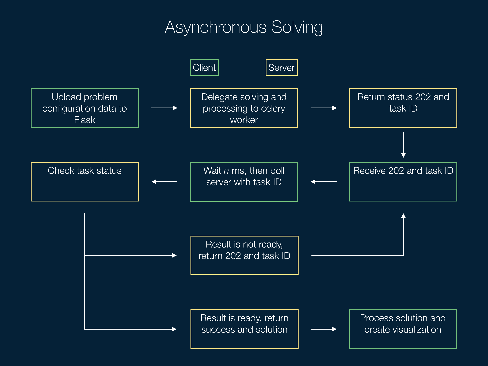

Benchmarking planners is a time consuming process, so instead of waiting on the
web page to see the results, users submit jobs and are notified when the results
become available. This process is handled by [Celery](http://www.celeryproject.org),
an asynchronous task queue implemented in Python. When a benchmarking job is
submitted, it is given to a Celery worker to execute, freeing up the Flask
server to continue to serve other requests. Using Celery for benchmarking was
fairly simple to setup since the client doesn't need any information from the
completed job.


However, solving a motion planning problem can also take a large
amount of time; solving them synchronously would be impractical.

<div class="subtitle">Asynchronous Solving</div>

The problem with making regular motion planning asynchronous is that the user
waits for the solution. For asynchronous solving to work, there must be
some amount of coordination between the client and server to ensure that the
right results are returned to the right user.



To solve this problem, I came up with the pattern seen above. When the user
submits a motion planning problem, the task is assigned to a Celery worker and
the ID of that task is immediately returned to the client. Then, the client
will periodically poll the server for the results.

```
@app.route('/omplapp/poll/<task_id>', methods=['POST'])
def poll(task_id):
    """
    Checks if the task corresponding to the input ID has completed. If the
    task is done solving, the solution is returned.
    """

    result = solve.AsyncResult(task_id)

    if result.ready():
        return json.dumps(result.get()), 200
    else :
        return "Result for task id: " + task_id + " isn't ready yet.", 202
```


